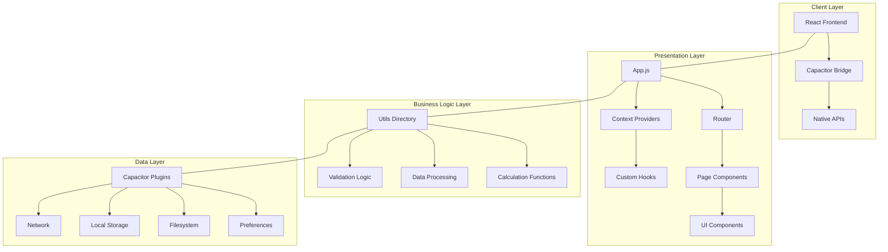
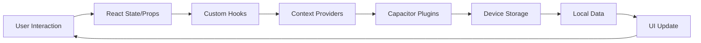
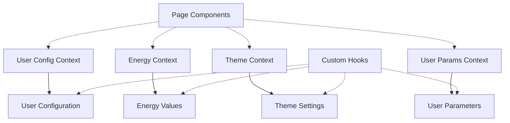
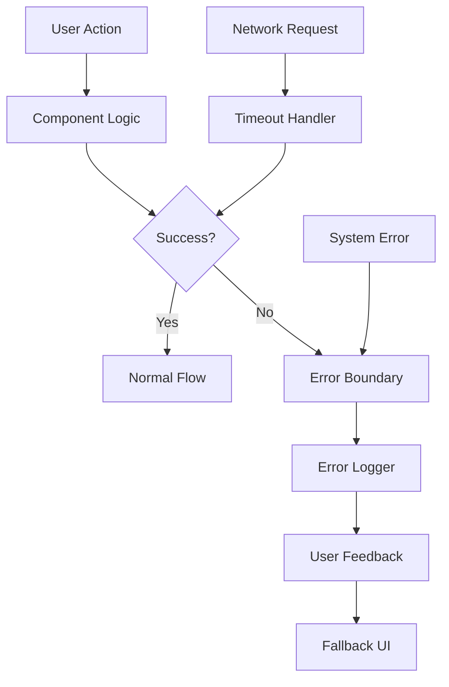

# Nice Today App - Architecture Overview

## High-Level Architecture



## Component Architecture

### Main Application Structure
```
App.js (Root Component)
├── Error Boundaries
├── Theme Provider
├── User Config Provider
├── Energy Provider
├── User Params Provider
└── Routing Layer
    └── Page Components (Lazy Loaded)
        ├── Dashboard Components
        ├── Astrology Components (Bazi, Zi Wei, Horoscope)
        ├── Health Tracking Components
        ├── Personality Test Components
        └── Lifestyle Components
```

### Data Flow Architecture



## Technology Stack Layers

### Frontend Framework
- **React 18.2.0**: Component-based UI rendering
- **React Router DOM 7.10.1**: Client-side routing
- **Tailwind CSS**: Styling and responsive design
- **React Hooks**: State and lifecycle management

### Mobile Abstraction Layer
- **Capacitor 5.7.8**: Native feature access
  - Filesystem plugin: Persistent data storage
  - Preferences plugin: Key-value storage
  - Geolocation plugin: Location services
  - Local Notifications: Push notifications
  - Device plugin: Device information
  - Network plugin: Network status monitoring

### Business Logic Layer
- **Custom Hooks**: Encapsulated logic (useThemeColor, etc.)
- **Utility Functions**: Calculation and processing (83+ files)
- **Calculation Engines**: Biorhythm, astrology algorithms
- **Data Processing**: Transformation and validation

### Data Management
- **React Context**: Global state management
- **Local Storage**: Temporary data caching
- **Capacitor Preferences**: Persistent user preferences
- **Capacitor Filesystem**: File-based data storage

## Module Organization

### Pages Module (src/pages/)
- **Astrology**: Bazi, Zi Wei, Horoscope, Tarot, etc.
- **Health**: Biorhythm, organ rhythm, wellness tracking
- **Personality**: MBTI, temperament tests
- **Lifestyle**: Dress guide, lifestyle advice, feng shui
- **Tools**: Various utility pages
- **Dashboards**: Summary views and analytics

### Components Module (src/components/)
- **Reusable UI**: Buttons, cards, dialogs
- **Specialized Widgets**: Charts, calendars, selectors
- **Layout Components**: Navigation, headers, footers
- **Forms**: User input components

### Utilities Module (src/utils/)
- **Calculations**: Algorithm implementations
- **Data Processing**: Parsing and transformation
- **Error Handling**: Logging and recovery
- **Version Management**: Update handling
- **Performance**: Optimization tools
- **Compatibility**: Cross-platform fixes

## State Management Architecture



## Performance Architecture

### Code Splitting Strategy
- **Route-level splitting**: Each route is lazily loaded
- **Error boundaries**: Isolated failure domains
- **Dynamic imports**: On-demand loading
- **Fallback components**: Graceful degradation

### Caching Strategy
- **Component caching**: React.memo for pure components
- **Data caching**: In-memory and persistent storage
- **Asset caching**: Service worker for offline access
- **API caching**: Response caching where appropriate

### Memory Management
- **Cleanup functions**: Proper effect cleanup
- **Event listeners**: Proper removal
- **Timers/intervals**: Cleanup on unmount
- **References**: Proper dereferencing

## Error Handling Architecture



## Mobile-Specific Architecture

### Platform Integration
- **WebView Optimization**: Android compatibility fixes
- **Native Feature Access**: Through Capacitor plugins
- **Offline Capability**: Progressive Web App features
- **Device APIs**: Camera, geolocation, notifications

### Build Pipeline
1. **Web Build**: Create React App + Craco enhancements
2. **Asset Bundling**: Optimized asset packaging
3. **Capacitor Sync**: Web assets to native projects
4. **Native Build**: Platform-specific compilation
5. **Distribution**: App store packages

## Security Architecture
- **Input Validation**: Client-side validation
- **Secure Storage**: Encrypted preferences where needed
- **Communication**: Secure API communications
- **Permissions**: Minimal required permissions
- **Privacy**: Local data processing

## Scalability Considerations
- **Modular Design**: Independent components
- **Separation of Concerns**: Clear architectural boundaries
- **Configuration Driven**: Feature toggles and settings
- **Plugin Architecture**: Extensible via Capacitor plugins
- **Component Reusability**: DRY principle implementation