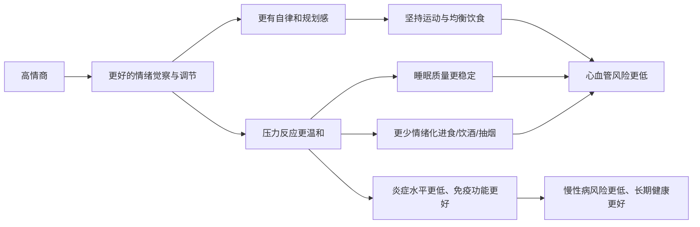

- 总体来看，**情商（情绪智力）和健康确实有显著正相关**——情商高的人，平均来说：
  - 心理压力更小、抑郁焦虑更少；
  - 更少抽烟、酗酒、暴饮暴食；
  - 更坚持规律运动、健康饮食和良好睡眠；
  - 炎症水平更低，心血管风险更小，长期健康结局更好。  
- 所以，**“情商高的人更会养生”在统计上是有证据支持的**，但不是什么“玄学”，而是通过“情绪管理 → 压力反应 → 健康行为 → 身体健康”这一整套链条在起作用。
下面我用一个简单的流程图帮你看清中间的逻辑，再讲细节和可操作建议。

## 一、情商到底是个啥？先拉齐概念
现在主流对“情商/情绪智力”（emotional intelligence, EI）的理解，大致包括这几块能力：
- 自我觉察：
  - 能准确意识到自己现在的情绪状态（生气、焦虑、失落等）。
- 自我调节：
  - 情绪上来时，能不被“劫持”，懂得缓解、转移、表达，而不是硬顶或压抑。
- 动机与自律：
  - 能为了长期目标延迟满足，比如坚持运动、早睡，而不是只图一时爽。
- 同理心：
  - 能理解别人的情绪，人际冲突少，社会支持更好。
- 社交技能：
  - 会沟通、会求助，遇到问题更容易得到别人的帮助。
这些能力，不只是“会说话、会做人”，更是实实在在影响你“怎么照顾自己”的能力。
## 二、研究怎么说：情商与健康、养生行为的关系
### 1）情商高 → 压力更小、心理更健康
- 多项综述与元分析发现，**情商与更低压力水平、更好的心理健康（更少抑郁焦虑、更高幸福感）存在稳定关联**，这种关联在各种人群（学生、职场人、患者）中都存在【turn0search0】【turn0search1】。
- 情商高的人更擅长：
  - 把压力源看作“问题”而不是“威胁”，
  - 用问题解决的方式去处理，而不是一味自责、抱怨、回避。
### 2）情商高 → 更健康的“三大基础行为”：运动、饮食、睡眠
研究已经比较明确地发现：
- 情商高的人更倾向于“主动自我照顾”：
  - 一篇研究综述指出，情绪智力更高的人，更可能保持规律运动、健康饮食等自我照顾行为【turn0search14】。
- 多项研究显示，情商与健康行为显著正相关：
  - 包括：更健康的饮食结构、更多的身体活动、更好的睡眠习惯、更高的健康责任感（比如定期体检）【turn0search14】【turn0search17】。
- 相反，情绪管理差的人更可能：
  - 吸烟、过量饮酒、久坐不动、吃更多高糖高脂食物来“抚慰情绪”【turn0search15】【turn0search16】。
简单说：  
情商高的人，“不开心时不一定要吃火锅喝大酒”，而是能用更健康的方式去调节情绪，比如去运动、找人倾诉、做点让自己有成就感的事。
### 3）情商高 → 心血管风险更低、炎症水平更低
- 情绪调节与心血管疾病风险：
  - 研究发现，情绪调节能力差的人，在面对心理压力时，容易出现更糟糕的心血管反应（如血压、心率异常升高），长期下来会增加心血管疾病风险【turn0search10】【turn0search11】。
  - 大样本数据也提示，长期焦虑、抑郁等情绪问题会增加心血管事件风险【turn0search13】。
- 情绪/情绪调节与炎症：
  - 越来越多的研究表明：不良的情绪调节方式与更高的外周炎症指标（如IL-6、CRP）相关，而较好的情绪调节能力与较低水平炎症有关【turn0search5】【turn0search7】【turn0search8】。
  - 炎症是很多慢性病（心血管、代谢病、部分肿瘤）的“土壤”，这部分与情绪/情商有间接但真实的关系。
### 4）情商高 → 自我照顾更好，压力缓冲更强
- 有研究专门探讨了“自我照顾”在情商与压力之间的中介作用，发现：
  - 情商高的人，更会进行有效的自我照顾，从而感受到更低压力，这种“自我照顾”包括健康生活方式与积极的应对策略【turn0search3】。
- 另外有研究发现，规律的中高强度运动，不仅降低压力感知，还能提高情绪智力和健康相关生活质量【turn0search4】。
## 三、为什么说“情商高的人更会养生”？具体在哪些地方“会”？
可以从几个生活化的场景来看：
### 1）情绪管理 vs 暴饮暴食 / 烟酒解压
- 典型场景：
  - 工作不顺、吵架、心情很差 → 有人会自动走“点奶茶、炸鸡、喝酒、抽烟”的路子；
  - 也有人会选：去跑步、泡个热水澡、写写情绪日记、找朋友聊聊。
- 情商高的人更可能：
  - 及时意识到自己“不是饿了，是情绪不好”；
  - 用“对健康友好”的方式缓解情绪，而不是单纯依赖高热量食物或酒精。
### 2）自律 vs 情绪化“躺平”
- 养生需要一定自律：按时睡觉、持续运动、控制饮食。
- 情商高的人一般：
  - 更擅长为“长期目标”牺牲短期快感（少刷一会儿手机、多睡一会儿）；
  - 在倦怠时，会调整节奏（比如“今天只做一半，但不停掉”），而不是直接放弃。
### 3）压力缓冲：同样是忙，为什么有人“忙而不垮”？
- 面对同样强度的工作/学习压力：
  - 情商高的人更容易：
    - 把它拆解成可执行的小任务；
    - 主动寻求社会支持（找人帮忙、沟通预期）；
    - 在过程中安排小休息和调节（呼吸、散步、听歌）。
- 结果：同样忙，他们的：
  - 睡眠更稳；
  - 胃肠问题、头痛、感冒等更少；
  - 长期看慢性病风险也更低。
### 4）更好的人际关系 = 更好的“养生环境”
- 良好的人际关系是健康的“保护伞”：
  - 婚姻质量高、朋友支持多的人，压力恢复更快、免疫更好、寿命更长（这一点在大量流行病学研究中被反复证实）。
- 情商高的人：
  - 更懂得表达感受而不是指责；
  - 在冲突中更容易找到双赢而不是“争个你死我活”；
  - 因此，长期生活在更少敌意、更多支持的环境中，这是隐形的“养生buff”。
## 四、情商不是天生的“天赋”，是可以练的“养生肌肉”
好消息是：情商和情绪调节能力，比身高、血型更像肌肉——可以练。
### 1）自我觉察：每天3个情绪小问题
睡前花1–2分钟回答三个问题：
- 今天我最强烈的情绪是什么？（比如：烦躁、委屈、开心、焦虑）
- 是什么事触发了它？
- 我做了什么来应对？效果如何？
坚持两周，你会发现自己对情绪的“识别率”和“分辨力”明显提升。
### 2）情绪调节：给自己设计一个“小工具箱”
提前想好几件“成本很低、随时能用”的调节方式，比如：
- 身体层面：
  - 深呼吸10次；
  - 喝一杯温水；
  - 出门快走5–10分钟；
  - 做20–30个开合跳或拉伸。
- 心理层面：
  - 写3行“情绪日记”；
  - 听一首让你平静或开心的歌；
  - 对自己说一句安慰的话（像对待好朋友那样）。
- 社交层面：
  - 发信息给一个“说话有用”的人；
  - 简单吐槽一句，不求对方解决，只求“被听到”。
当情绪上头时，优先从工具箱里选一件来做，而不是马上点外卖/开酒/刷短视频。
### 3）用“微习惯”把健康行为绑进情绪生活
不要一次性追求“养生大招”，而是把健康行为“挂”在日常流程上：
- 比如：
  - 刷完牙 → 做5个拉伸或深蹲；
  - 换下睡衣前，先把第二天的运动服摆好；
  - 喝第一杯咖啡/茶前，先喝一杯温水；
  - 工作每隔1小时，起身走2分钟。
这类小习惯需要的意志力很低，但能明显改变长期健康轨迹，而“愿意坚持微习惯”本身就是高情商的表现之一——懂得用系统，而不是死磕意志力。
### 4）刻意练习“情绪语言”：会命名，就会管理
很多情绪问题来自“只会说：我不爽”，而更细一点，会更有帮助：
- 尝试更细致地命名情绪：
  - “我不是只是生气，我是感到：被忽视 / 委屈 / 不公平 / 担心 / 无助。”
- 当你能更准确命名情绪，大脑的前额叶会更容易介入，而不是被杏仁核（警报中心）完全接管——这是情绪调节的神经基础，也是情商高的人“不失控”的底层机制。
## 五、也要注意几个误区
### 1）情商高 ≠ 情绪“永远平稳”或“只会忍”
- 情商高的关键不是“不生气/不难过”，而是：
  - 允许情绪发生，但不会被情绪绑架做伤害自己的事；
  - 不搞“情绪压路机”——表面忍着，里面爆炸。
- 适当地表达愤怒、设定边界，是健康的、也是高情商的表现。
### 2）情商高 ≠ 天生“自律超人”
- 很多自律的人，其实是善于：
  - 把“应该做的事”转化为“愿意做的事”（比如，运动=“我的充电时间”）；
  - 通过设计环境和规则，减少对意志力的依赖。
- 这一点是可以学习和练习的，不只是性格问题。
### 3）情商只是“加分项”，不是“免死金牌”
- 情商高，确实平均上更健康、更会养生；
- 但如果你：
  - 长期熬夜、暴饮暴食、吸烟酗酒，
  - 工作环境极度有毒，完全不设边界，
  - 有明显家族高危因素又不做体检，
  那情商再高也挡不住身体的反噬。
- 更准确的公式是：  
  基因 + 环境 + 情商（生活方式/压力管理）→ 你最终的长期健康状态。
## 六、小结：情商是养生版的“操作系统”
- 如果把健康比作硬件：
  - 饮食、运动、睡眠是“三大硬件维护”；
  - 情商更像是操作系统：
    - 它决定了你“愿不愿意、能不能持续”去维护硬件；
    - 也决定了你在遭遇压力、冲突、变故时，是“崩盘”还是“快速重启”。
- 从研究和实际生活来看：
  - 情商高的人确实更会养生，但本质是：  
    **更会处理情绪 → 更少自我伤害 + 更多健康行为 → 更好的身体。**
如果你愿意，下一步可以一起帮你做一个“个人情商 + 养生习惯小盘点”，看看你目前在“情绪觉察、情绪调节、健康行为”这三块分别是什么状态，再针对性做一两个具体练习。
